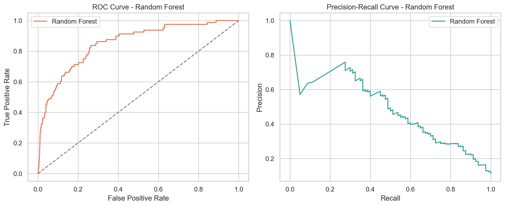
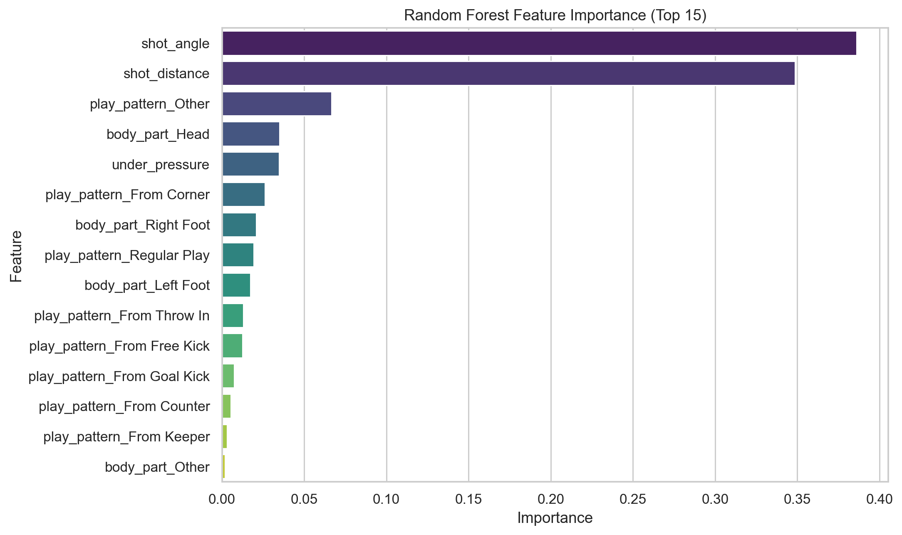
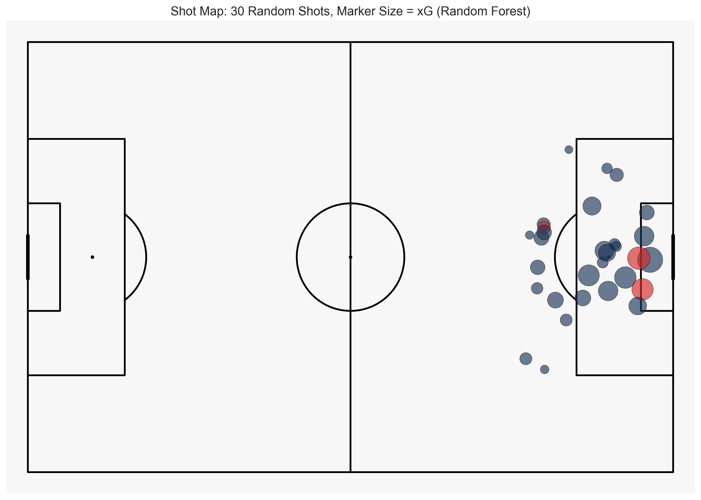
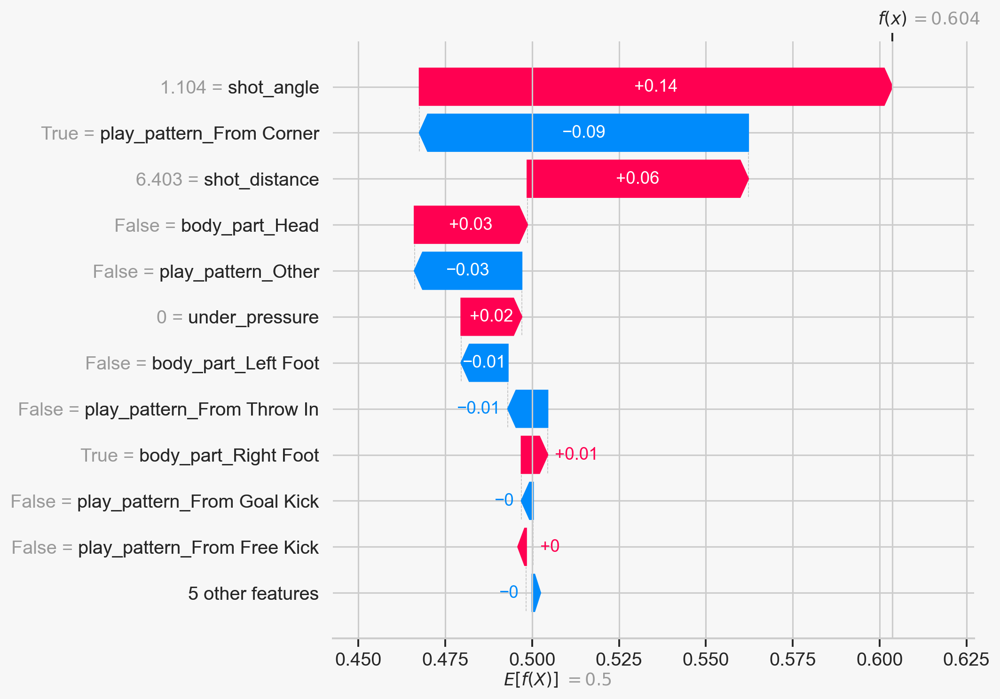

# Soccer xG Model with Random Forest

## Project Summary
This project estimates Expected Goals for football shots using StatsBomb open event data and a Random Forest classifier

The model predicts probability of goal for each shot and uses that probability as xG

## Data and Features
- Dataset: FIFA World Cup 2022 and UEFA Euro 2024 shot events from StatsBomb open data
- Target: is_goal where 1 means goal and 0 means no goal
- Core geometry features: shot_distance and shot_angle
- Context features: under_pressure, body_part, play_pattern

Preprocessing notes
- Missing values in body_part and play_pattern are filled with Unknown and treated as strings
- under_pressure is converted to numeric 0 or 1
- is_goal is created from shot_outcome where Goal maps to 1 and all other outcomes map to 0

## Model and Results
- Model: RandomForestClassifier
- Split: 75 train and 25 test with stratification
- ROC AUC: 0.8114
- Log Loss: 0.3840
- Brier Score: 0.1155
- PR AUC: 0.5085

Interpretation
- ROC AUC above 0.80 shows strong ranking quality between goals and non goals
- Log Loss and Brier Score suggest useful probability calibration for a rare event task
- PR AUC above baseline indicates practical signal under class imbalance

## Visual Analysis

### ROC and Precision Recall Curves

Interpretation
- The ROC curve stays well above the random reference line
- The precision recall shape matches expected tradeoff as recall increases

### Feature Importance

Interpretation
- shot_angle and shot_distance are the strongest drivers of predicted xG
- play_pattern and pressure related features add secondary value

### Shot Map with Predicted xG

Interpretation
- The plot shows a seeded random sample of 30 shots for readability
- Larger markers still indicate higher predicted xG within that sample

### SHAP Waterfall for One Goal Shot Near 0.60 xG

Interpretation
- This explanation uses a real goal shot whose predicted xG is closest to 0.60
- SHAP shows how each feature pushes the prediction above or below the model baseline

## Output Location
Generated figures are saved in assets/images
