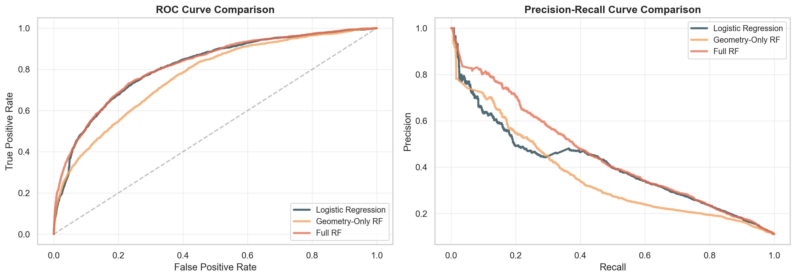
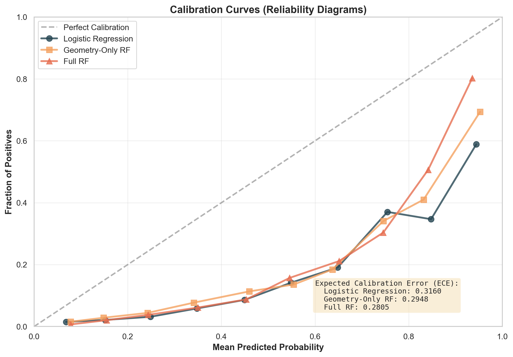

# Soccer xG Model with Random Forest

## Project Summary
This project estimates Expected Goals for football shots using StatsBomb open event data and a Random Forest classifier. The model predicts probability of goal for each shot and uses that probability as xG.

## Data and Features
**Dataset:** All available men's competitions from StatsBomb open data (loaded dynamically), with parquet caching to avoid redundant API calls. On first run, data is fetched and cached to `data/shots_cache.parquet`; subsequent runs load from disk in seconds.

**Target:** `is_goal` where 1 means goal and 0 means no goal

**Features:**
- **Geometry:** shot_distance, shot_angle (derived from pitch coordinates)
- **Context:** under_pressure, body_part, shot_technique
- **Binary flags:** is_first_time, is_deflected, is_one_on_one, is_aerial_won
- **Defensive:** defenders_in_cone (count of opponents blocking shot line in freeze frame)

**Preprocessing:**
- Shot locations extracted from numpy arrays into x, y coordinates
- Geometry features (distance/angle) calculated relative to goal center
- body_part and shot_technique filled with "Unknown" for missing values
- Binary flags created from StatsBomb presence fields (notna ≈ True)
- defenders_in_cone computed by analyzing shot freeze frame positions
- is_goal created from shot_outcome (Goal → 1, else → 0)

## Model and Results
- **Model:** RandomForestClassifier (n_estimators=400, max_depth=10, min_samples_leaf=5, balanced_subsample)
- **Split:** 75% train / 25% test with stratification

**Performance Metrics:**

| Model | ROC-AUC | Log Loss | Brier Score | PR-AUC |
|-------|---------|----------|------------|--------|
| Logistic Regression | 0.8137 | 0.5343 | 0.1751 | 0.4042 |
| Geometry-Only RF | 0.7671 | 0.5318 | 0.1788 | 0.3600 |
| **Full RF** | **0.8194** | **0.4981** | **0.1624** | **0.4501** |

**Benchmark Analysis:**
Geometry alone (distance and angle) captures substantial predictive power: the geometry-only RF achieves 0.7671 ROC-AUC. Adding contextual features (body part, shot technique, pressure, one-on-one, deflection, and aerial wins) lifts the full RF model to 0.8194, a gain of 52 basis points in ROC-AUC, 9 basis points in PR-AUC, and 16 basis points in Brier Score. This confirms that contextual information provides genuine signal, particularly for identifying high-quality chances (evidenced by the PR-AUC gain). In head-to-head comparison, the full RF and Logistic Regression achieve nearly identical ROC-AUC (0.8194 vs 0.8137), but the RF produces superior probability calibration: Log Loss of 0.4981 versus 0.5343, and Brier Score of 0.1624 versus 0.1751. For xG modeling, where probability accuracy matters beyond mere ranking, the Random Forest with full features is the justified choice.

**Interpretation:**
- ROC AUC > 0.80 indicates strong ranking quality between goal and non-goal shots
- Log Loss and Brier Score show that the Full RF produces sharper 
  probability estimates than the baselines, though absolute calibration 
  remains limited — see Calibration Analysis below
- PR AUC above baseline shows the model has practical predictive signal
- Contextual feature lift (Full RF vs Geometry-Only RF) validates the importance of shot context and pressure

## Visual Analysis

### ROC and Precision-Recall Curves

The ROC curve stays well above the random reference line; the precision-recall curve shows the expected tradeoff between recall and precision under class imbalance.

### Baseline Model Benchmark

Comparison of three models on overlaid ROC and PR curves: Logistic Regression (linear baseline), Geometry-Only Random Forest (pure geometry features), and Full Random Forest (all features). Geometry captures 0.7671 ROC-AUC alone, while contextual features push the full model to 0.8194, validating their contribution to distinguishing genuine scoring opportunities.

### Calibration Analysis

All three models exhibit notable miscalibration: they lie systematically below the diagonal reference (perfect calibration) in the mid-probability range (~0.4–0.8), indicating overconfidence. Specifically, when the model predicts ~0.6 xG, the actual goal rate is closer to 0.15–0.22. ECE values of 0.28–0.32 are high in absolute terms and reflect poor calibration, not trustworthy probability estimates. The Full RF model achieves the lowest ECE of 0.2805, but this represents "best among three poorly calibrated models" rather than well-calibrated predictions. This overconfidence pattern is a known and expected behavior of Random Forest and tree-based classifiers generally on heavily imbalanced datasets (~10% positive rate). xG models are inherently probabilistic, and some miscalibration is common even in production commercial systems. For applications requiring precise probability estimates, post-hoc calibration methods such as Platt scaling or isotonic regression would be a natural next step.

### Feature Importance

shot_distance and shot_angle dominate model predictions (as expected—geometry is fundamental to xG). Binary contextual features (one_on_one, deflected, aerial_won) and body_part provide secondary signal.

### Shot Map: All Shots with Predicted xG

All shots from the test set split into Goals (red) vs Non-Goals (blue). Marker size scales with predicted xG, revealing how the model assigns higher xG to successful attempts vs. failures (though substantial overlap remains due to inherent randomness in football).

### SHAP Waterfall: One Goal Shot Near 0.60 xG

SHAP reveals how each feature pushes the prediction above or below the model baseline for an individual shot close to 0.60 xG.

## Implementation Notes

**Caching Strategy:**
- First run: Fetches all men's competitions from StatsBomb API and saves shots to `data/shots_cache.parquet`
- Subsequent runs: Loads from parquet instantly (~1-2 seconds)
- To refresh data, delete `data/shots_cache.parquet` and re-run the data loading cell

**Feature Engineering:**
- Location coordinates converted from numpy arrays using `hasattr(v, '__len__')`
- Freeze frame data parsed to extract defender positions and goalkeeper location
- Binary contextual features derived from presence of StatsBomb flags (e.g., shot_deflected.notna() → is_deflected)

**Model Architecture:**
- Random Forest chosen for interpretability (feature importance available)
- Balanced class weighting to handle goal/non-goal imbalance (~10% goal rate)
- One-hot encoding applied to categorical features (body_part, shot_technique)
- Train/test split stratified on target to preserve class distribution

## Running the Notebook
1. Install dependencies: `pip install numpy pandas scikit-learn matplotlib seaborn statsbombpy mplsoccer shap tqdm pyarrow`
2. Execute cells sequentially: data loading → feature engineering → model training → visualizations
3. First run will fetch ~73k shots and cache; subsequent runs load from disk
4. Generated figures saved to `assets/images/`
